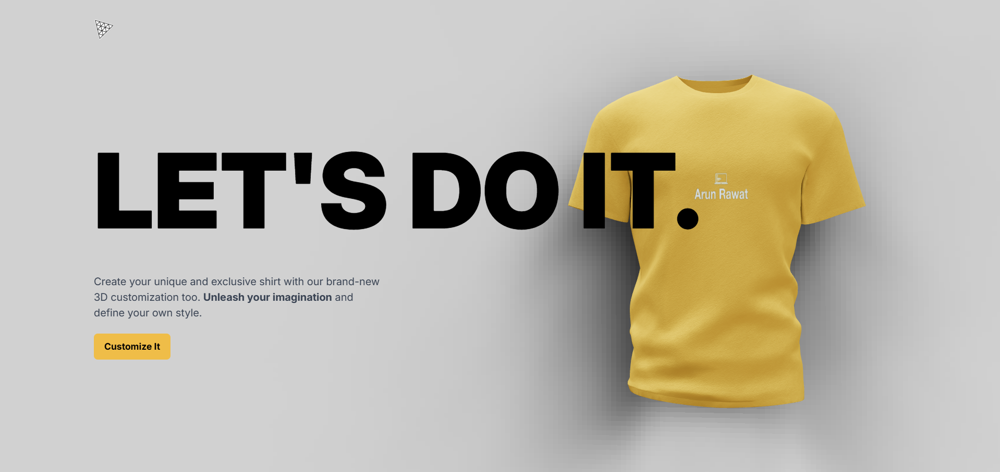
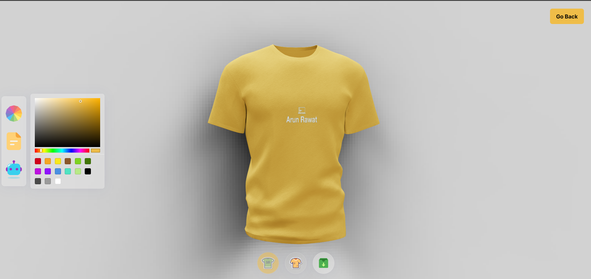

## 📸 Screenshots and Demo

<div style="display: flex; justify-content: space-between;">
  <div style="flex: 1; padding-right: 10px;">
   <p>Home Page<p>
    

  </div>
  <div style="flex: 1; padding-left: 10px;">
      <p>Customization Page<p>
    
  </div>
</div>

### 3D T-Shirt App Demo

https://github.com/user-attachments/assets/5e2b782a-d8b9-4924-8176-c8363389ab61

# 3D T-shirt Customization App 🎨

A dynamic 3D customization application built with React, Three.js, and GenerativeAI. Personalize your virtual T-shirt with colors, logos, and AI-generated designs.

---

## 📋 Table of Contents

1. [Introduction](#introduction)
2. [Tech Stack](#tech-stack)
3. [Features](#features)
4. [Quick Start](#quick-start)

---

## <a name="introduction">🤖 Introduction</a>

The **3D T-shirt Customization App** empowers users to design personalized 3D T-shirt with unique colors, textures, and logos. Leverage AI for intelligent logo and texture generation, creating one-of-a-kind designs that reflect your style.

This project demonstrates the integration of advanced technologies like **React.js**, **Three.js**, and **GenerativeAI** in building interactive 3D applications.

---

## <a name="tech-stack">⚙️ Tech Stack</a>

- **React.js**
- **Three.js**
- **React Three Fiber**
- **React Drei**
- **Vite**
- **Tailwind CSS**
- **Node.js**
- **Express.js**
- **GenerativeAI**
- **Framer Motion**
- **Valtio**

---

## <a name="features">🔋 Features</a>

- **3D Customization**: Design 3D shirts and T-shirt dynamically.
- **Color & Texture Customization**: Choose colors or upload textures for personalized styling.
- **Logo Upload**: Add custom logos to 3D designs.
- **AI Integration**: Use AI to generate logos and textures.
- **Download Designs**: Save your customized T-shirt.
- **Responsive Design**: Enjoy seamless experiences on all devices.
- **Animations**: Smooth transitions with Framer Motion.

---

## <a name="quick-start">🤸 Quick Start</a>

### Prerequisites

Ensure you have the following installed:

- [Git](https://git-scm.com/)
- [Node.js](https://nodejs.org/)
- [npm](https://www.npmjs.com/)

### Setup

1. **Clone the Repository**

   ```bash
   git clone https://github.com/ArunRawat404/3D-T-Shirt-Customization.git
   cd 3D-T-Shirt-Customization
   ```

2. **Installation**

Install the project dependencies using npm in both client and server folders:

```bash
npm install
```

3. **Set Up Environment Variables**

Create a new file named `.env` in the root of your project and add the following content:

```env
API_KEY=
```

Replace the placeholder values with your actual text-to-image model credentials. In this project I used clipdrop. You can obtain these credentials by signing up on the [Open website](https://clipdrop.co/).

**Running the Project**

1. Server
   ```bash
   npm start
   ```
2. Client
   ```bash
   npm run dev
   ```

Open [http://localhost:5173](http://localhost:5173) in your browser to view the project.
